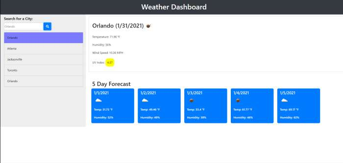

# Weather Dashboard

## Description

This repo contains an html/css/javaScript/jquery web application grabs weather information based on city. A user can type in a city into the input field to retrieve relevant current day weather data as well as a 5 day future forecast. User's searches are saved into the history panel for convenience.

 

* Displays the user with an input field for searching a particular cities current and future weather forecasts
* Keeps a history of a user's searches and allows the user to easily circle back to a previous search
* Application stores and loads any previous search and formats them into a nice list

 

This weather dashboard is intended to make your weather information experience a BREEEEEEZE.

 

[Weather Dashboard](https://rickhill543.github.io/weather-dashboard/)

***

## Installation

N/A

***

## Usage

For dynamically creating a weather dashboard that is dynamically generated from api fetch calls

 

***

## Credits

W3Schools for always being there | 
[W3Schools](https://www.w3schools.com/)

 

***

## License

All Rights Reserved.